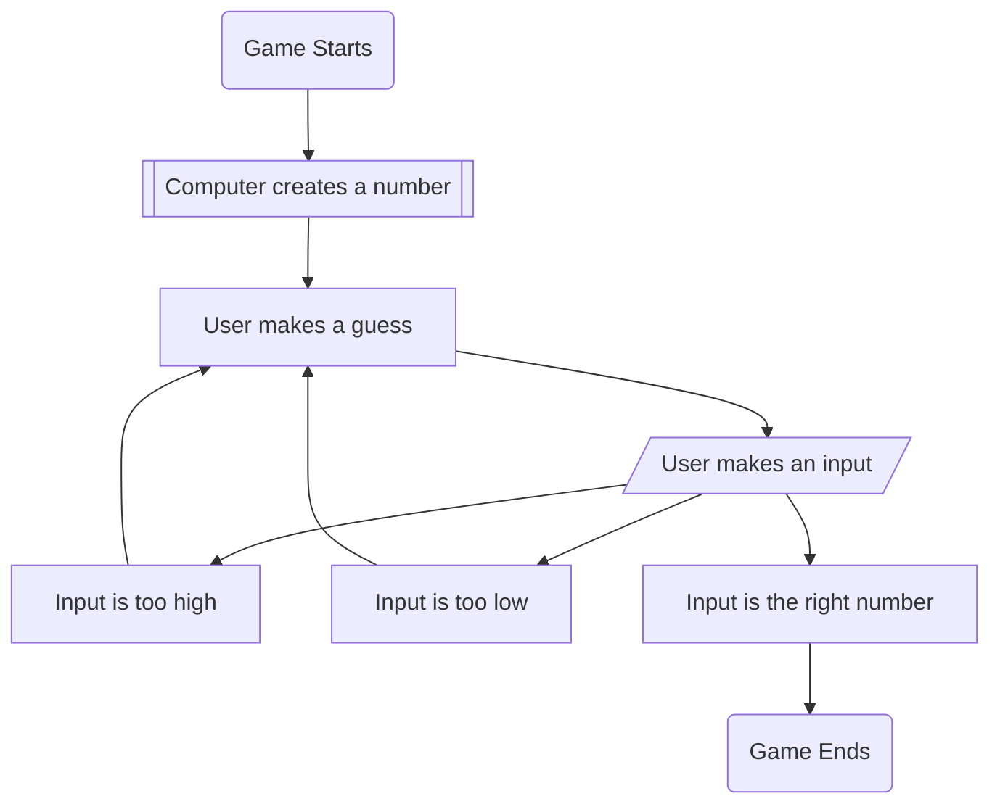
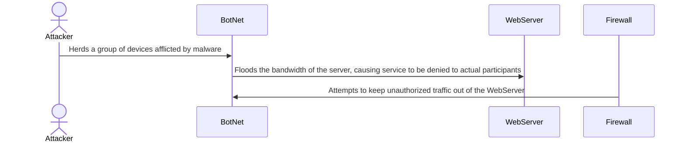
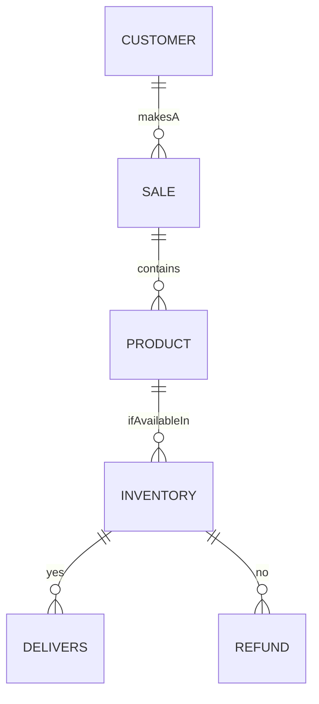

##### Flowchart that shows the process of how a random number game is played out 

##### Sequence diagram which shows the process of a DDoS attack 

##### Nike Store ERDiagram which shows the process of how something is ordered, and delivered 
